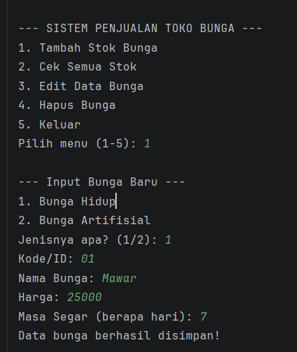
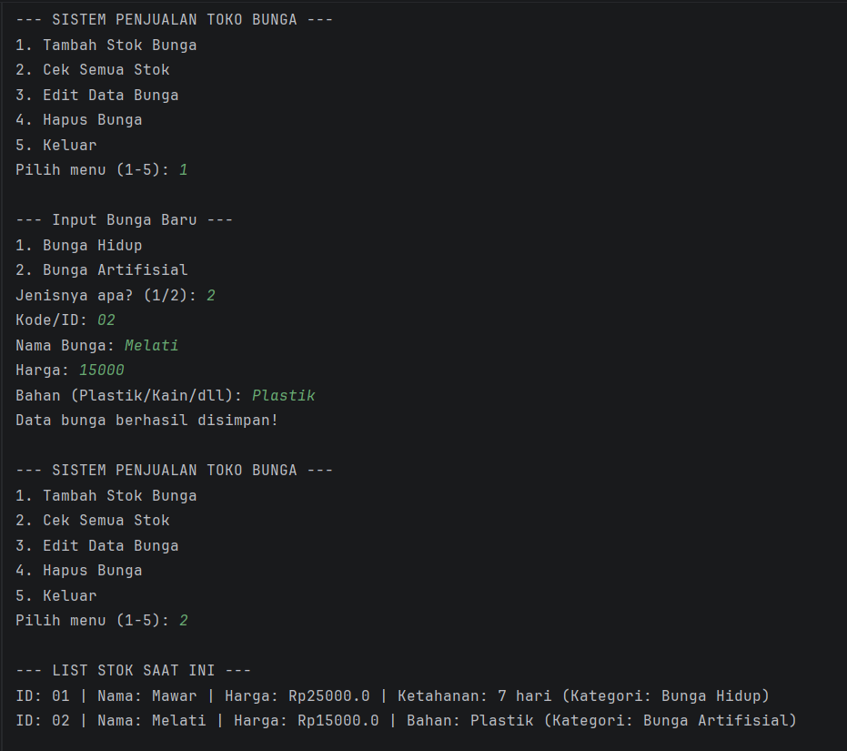
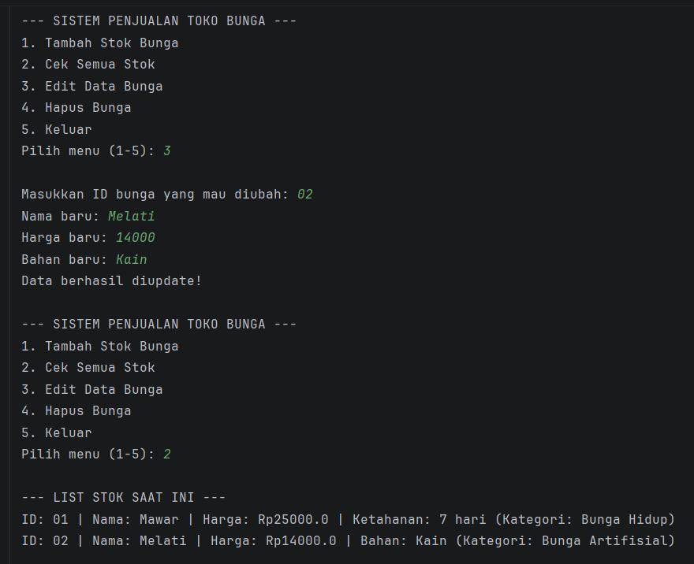
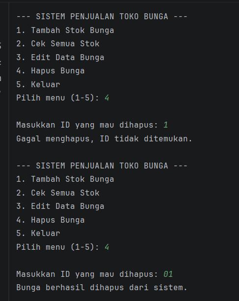
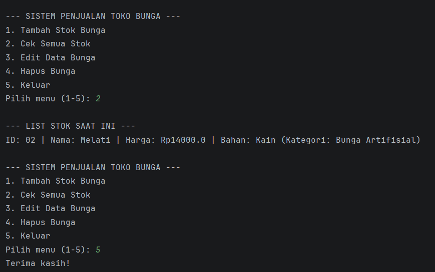

# Sistem Penjualan Toko Bunga (Florist)

Aplikasi manajemen stok barang berbasis terminal (Console CLI) untuk Toko Bunga. Program ini dibangun menggunakan bahasa pemrograman Java untuk mendemonstrasikan prinsip-prinsip Pemrograman Berorientasi Objek (PBO) sesuai penugasan Ujian Tengah Semester.

## Deskripsi Proyek
Proyek ini memudahkan admin toko untuk melakukan inventarisasi stok bunga. Sistem mendukung dua kategori produk berbeda: **Bunga Hidup** dan **Bunga Artifisial**, yang dikelola secara dinamis menggunakan `ArrayList`.

## Pemenuhan Kriteria UTS
Berdasarkan persyaratan yang diberikan, proyek ini telah mengimplementasikan:

* **Perulangan (Looping):** Menggunakan `while(true)` agar menu interaktif dapat terus berjalan secara berulang.
* **Percabangan (Kondisi):** Menggunakan kombinasi `switch-case` untuk navigasi menu utama dan `if-else` untuk validasi tipe data.
* **Enkapsulasi (Encapsulation):** Semua data variabel disembunyikan menggunakan akses `private` dan dikelola aman via *getters* dan *setters*.
* **Pewarisan (Inheritance):** Menggunakan kata kunci `extends` untuk menghubungkan kelas induk dengan kelas turunan.
* **Polimorfisme (Polymorphism):** Menerapkan metode overriding `tampilkanData()` serta dinamisme koleksi `ArrayList<Tanaman>`.

## Struktur Class
Arsitektur Object-Oriented Programming (OOP) yang diterapkan di sistem ini:

1. **Tanaman (Induk):** Kelas dasar dengan properti umum berupa `id`, `nama`, dan `harga`.
2. **BungaHidup (Anak):** Pewarisan dari `Tanaman` yang memiliki properti tambahan spesifik `masaSegar`.
3. **BungaArtifisial (Anak):** Pewarisan dari `Tanaman` yang memiliki properti tambahan spesifik berupa jenis `bahan`.
4. **Main:** Kelas utama (*driver class*) yang menjalankan alur logika program dan interaksi terminal.

## Fitur Program
Menu interaktif yang tersedia di dalam sistem ini meliputi:
**Tambah Stok (Create):** Memasukkan data bunga baru ke sistem berdasarkan kategorinya.
**Cek Semua Stok (Read):** Menampilkan semua bunga yang tersimpan di dalam memori gudang saat ini.
**Edit Data Produk (Update):** Mengubah informasi nama, harga, dan variabel unik menggunakan fungsi pencarian ID.
**Hapus Produk (Delete):** Menghapus data bunga dari gudang menggunakan metode `removeIf`.

## Cara Menjalankan
1. Pastikan mesin komputermu sudah terinstal **Java Development Kit (JDK)**.
2. Kloning (*clone*) repositori ini ke dalam direktori lokalmu.
3. Buka proyek ini menggunakan IntelliJ IDEA atau IDE favoritmu.
4. Jalankan (*run*) berkas `Main.java`.

## Screenshot Program
1. 
2. 
3. 
4. 
5. 

## Data Diri
* **Nama:** Nabila Putri Karni
* **NIM:** 2409106041
* **Program Studi:** Informatika
